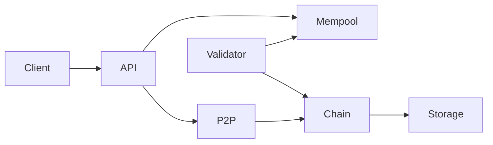

# Pixie Block

Blockchain customizada em Go para transações financeiras com repasse automático de impostos e descontos para uma conta central de impostos (`tax_treasury`), com o saldo líquido creditado na conta do recebedor.

## Arquitetura



- **Consenso**: Proof of Authority (PoA) com validadores definidos no genesis
- **Persistência**: bbolt (`pixie.db` por nó)
- **P2P**: TCP + JSON gossip para transações e blocos
- **Assinaturas**: Ed25519 para transações (payer) e blocos (validador)

## Estrutura

```
cmd/node/          # Binário do nó
config/            # genesis.json, keystore.json, validator-key.json
internal/
  domain/          # Block, Transaction, Account
  ledger/          # Validação e aplicação de splits fiscais
  chain/           # Encadeamento e índice de transações
  mempool/         # Pool de transações pendentes
  consensus/poa/   # Produção de blocos PoA
  storage/bolt/    # Persistência
  p2p/             # Gossip e sync
  api/             # REST HTTP
tools/genkeys.go   # Gera chaves de demonstração
```

## Pré-requisitos

- Go 1.22+

## Setup

```bash
# Gerar chaves e arquivos de configuração de demonstração
make genkeys

# Compilar
make build

# Rodar testes
make test
```

## Rodar um nó

```bash
make run
```

O nó expõe a API em `http://localhost:8080` e P2P em `:9000`.

## Rodar cluster local (2 nós)

```bash
make run-cluster
```

- Nó 1: API `:8080`, P2P `:9000`
- Nó 2: API `:8081`, P2P `:9001` (conecta ao nó 1)

## Contas de demonstração (genesis)

| Conta | Saldo inicial | Papel |
|-------|---------------|-------|
| `tax_treasury` | R$ 0,00 | Conta central de impostos |
| `merchant_001` | R$ 10.000,00 | Pagador (possui chave no keystore) |
| `supplier_042` | R$ 0,00 | Recebedor |

## Exemplo: submeter transação

```bash
curl -s -X POST http://localhost:8080/v1/transactions \
  -H 'Content-Type: application/json' \
  -d '{
    "payer": "merchant_001",
    "payee": "supplier_042",
    "items": [
      { "description": "Serviço de consultoria", "amount": 100000 }
    ],
    "tax_splits": [
      { "tax_code": "ISS", "rate_bps": 500, "amount": 5000, "tax_account": "tax_treasury" }
    ],
    "discounts": [
      { "code": "PIS_CREDIT", "amount": 1650, "tax_account": "tax_treasury" }
    ]
  }' | jq .
```

Valores em **centavos**:
- Bruto: R$ 1.000,00 (`100000`)
- ISS: R$ 50,00 (`5000`) → `tax_treasury`
- Desconto PIS: R$ 16,50 (`1650`) → `tax_treasury`
- Líquido ao recebedor: R$ 933,50 (`93350`)

Após ~5 segundos (block time), o validador inclui a transação em um bloco.

## Consultas

```bash
# Último bloco
curl -s http://localhost:8080/v1/blocks/latest | jq .

# Saldo do recebedor
curl -s http://localhost:8080/v1/accounts/supplier_042/balance | jq .

# Saldo da conta de impostos
curl -s http://localhost:8080/v1/accounts/tax_treasury/balance | jq .

# Metadados da chain
curl -s http://localhost:8080/v1/chain | jq .
```

## Flags do nó

| Flag | Default | Descrição |
|------|---------|-----------|
| `--data-dir` | `./data` | Diretório de persistência |
| `--genesis` | `config/genesis.json` | Arquivo genesis |
| `--keystore` | `config/keystore.json` | Chaves de contas pagadoras |
| `--validator-key` | `config/validator-key.json` | Chave do validador PoA |
| `--api-addr` | `:8080` | Endereço da API HTTP |
| `--p2p-listen` | `:9000` | Endereço P2P |
| `--node-id` | `node-1` | Identificador do nó |
| `--peer` | — | Peer(s) separados por vírgula |

## Regras on-chain

1. `sum(items) == gross_amount`
2. `sum(tax_splits) + sum(discounts) + net_to_payee == gross_amount`
3. Contas fiscais devem estar em `allowed_tax_accounts` do genesis
4. Pagador deve ter saldo suficiente
5. Transação assinada pelo pagador; bloco assinado pelo validador PoA

## Limitações do MVP

- Sem smart contracts — regras fiscais validadas pelo nó
- Sem privacidade — valores públicos na chain
- PoA simples — sem BFT formal
- P2P sem NAT traversal — peers configurados manualmente
- Sem integração bancária — contas são endereços internos do ledger
