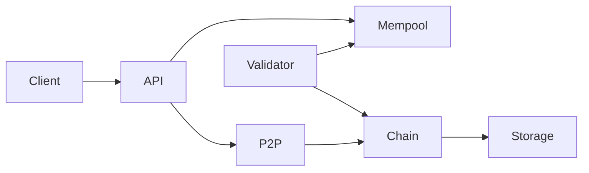

# Pixie Block

Blockchain customizada em Go para transações financeiras com repasse automático de impostos (via `tax_codes` + `config/taxes.json`), ledger PoA e explorer HTMX.

**Documentação completa:** com o nó no ar, abra [`/v1/docs/`](http://localhost/v1/docs/) (visual estilo API Platform + OpenAPI/Scalar).

## Arquitetura



- **Consenso**: Proof of Authority (PoA) com validadores no genesis
- **Persistência**: bbolt (`pixie.db` por nó)
- **P2P**: TCP + JSON gossip para transações e blocos
- **Assinaturas**: Ed25519 (payer / validador)
- **Privacidade de leitura**: viewer via `pkey` / `X-Private-Key` (anônimo, conta ou audit)

## Estrutura

```
cmd/server/        # Binário do nó
config/            # genesis, keystore, validator-key, taxes
docs/              # Site de docs (servido em /v1/docs/)
dist/              # Explorer HTMX
internal/
  domain/          # Block, Transaction, Account
  ledger/          # Validação e aplicação de splits fiscais
  chain/           # Encadeamento e índice de transações
  mempool/         # Pools (payments, creates, closes)
  consensus/poa/   # Produção de blocos PoA
  storage/bolt/    # Persistência
  p2p/             # Gossip e sync
  api/             # REST HTTP + SSE
tools/genkeys.go   # Gera chaves de demonstração
```

## Pré-requisitos

- Go 1.22+

## Setup

```bash
make genkeys
make build
make test
```

## Rodar um nó

```bash
make run
```

Com o Makefile:

| Serviço | Endereço |
|---------|----------|
| API / Explorer | `http://localhost:80` |
| Docs | `http://localhost/v1/docs/` |
| P2P | `:90` |

O default do binário é `--api-addr :8080`; `make run` usa `:80`.

## Rodar cluster local (2 nós)

```bash
make run-cluster
```

- Nó 1 (produtor): API `:80`, P2P `:90`
- Nó 2 (follower): API `:81`, P2P `:91` → peer `127.0.0.1:90`

## Contas de demonstração

Geradas por `make genkeys` a partir de `tools/accounts.json` (ex.: `person_*`, `merchant_*`, treasuries). Chaves em `config/keystore.json` e `config/validator-key.json`.

## Exemplo: submeter transação

Valores em **centavos**. Impostos vêm de `config/taxes.json` pelos `tax_codes` do item (não envie `tax_splits` no body). Payee `person` não pode ter `tax_codes`.

```bash
curl -s -X POST http://localhost/v1/transactions \
  -H 'Content-Type: application/json' \
  -d '{
    "payer": "merchant_001",
    "payee": "person_001",
    "items": [
      { "description": "Pagamento", "amount": 1000, "tax_codes": [] }
    ]
  }' | jq .
```

Após ~5 segundos (`block_time_seconds`), o validador inclui a TX em um bloco.

## Consultas

```bash
# Último bloco (visão pública; use ?pkey= para viewer)
curl -s http://localhost/v1/blocks/latest | jq .

# Saldo
curl -s http://localhost/v1/accounts/person_001/balance | jq .

# SSE da chain (não é JSON one-shot)
curl -N http://localhost/v1/chain
```

## Flags do nó

| Flag | Default | Descrição |
|------|---------|-----------|
| `--data-dir` | `./data` | Persistência |
| `--genesis` | `config/genesis.json` | Genesis |
| `--keystore` | `config/keystore.json` | Chaves de contas |
| `--validator-key` | `config/validator-key.json` | Produtor PoA (`""` = follower) |
| `--taxes` | `config/taxes.json` | Tabela de impostos |
| `--api-addr` | `:8080` | HTTP |
| `--p2p-listen` | `:9000` | P2P |
| `--node-id` | `node-1` | ID do nó |
| `--peer` | — | Peers separados por vírgula |
| `--bolt-nosync` | false | Bolt NoSync (demo) |

## Regras on-chain (resumo)

1. Contas fiscais em `allowed_tax_accounts`
2. Pagador com saldo suficiente (reserva no mempool)
3. Payment assinada pelo payer (keystore do nó); bloco pelo validador
4. Create account: só produtor; close person (validador) vs merchant (pkey, saldo 0)

Detalhes: [docs](http://localhost/v1/docs/#/getting-started).

## Limitações do MVP

- Sem smart contracts — regras fiscais no nó
- Privacidade parcial (viewer em blocos/TXs/SSE); listagem de contas ainda pública
- PoA simples — sem BFT formal
- P2P sem NAT traversal — peers manuais
- Sem integração bancária — contas internas do ledger
